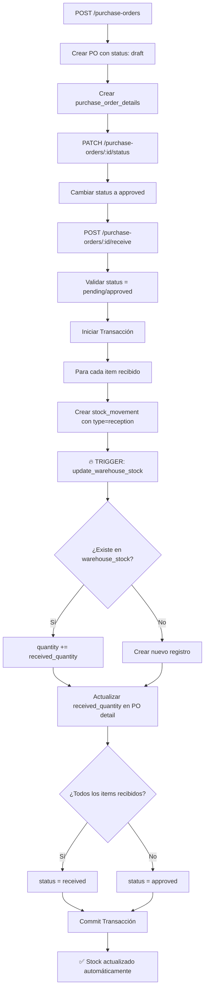

# Flujo de Purchase Orders y Gestión de Stock

## Resumen Ejecutivo

El sistema maneja el stock de manera **automática** mediante un **trigger de base de datos** (`trg_update_warehouse_stock`) que se activa cuando se crea un registro en `stock_movements`. No necesitas actualizar manualmente `warehouse_stock`.

---

## 1. Crear Purchase Order (POST `/api/v1/inventory/purchase-orders`)

### Flujo del Código

```typescript
// purchase-order.service.ts - createPurchaseOrder()
```

**Pasos:**

1. **Validación de datos** (via `createPurchaseOrderValidator`)
   - `supplierId` (requerido)
   - `warehouseId` (requerido)
   - `expectedDate` (opcional)
   - `items[]` con `productId`, `quantity`, `unitCost`

2. **Creación en base de datos** (via `PurchaseOrderRepository.create()`)
   ```typescript
   // Se crea el registro en purchase_orders
   {
     supplier_id, warehouse_id, expected_delivery_date,
     po_number: "PO-241202-XXXX", // auto-generado
     subtotal: calculado,
     total: calculado,
     status: 'draft'
   }
   
   // Se crean los detalles en purchase_order_details
   {
     purchase_order_id, product_id, quantity, unit_cost,
     subtotal, tax, total,
     received_quantity: 0 // importante!
   }
   ```

3. **Resultado:** Purchase Order creada con `status: 'draft'`

> **⚠️ IMPORTANTE:** En este punto **NO se afecta el stock**. Solo se registra la orden.

---

## 2. Actualizar Estado de Purchase Order (PATCH `/api/v1/inventory/purchase-orders/:id/status`) ✨ **NUEVO**

### Flujo del Código

```typescript
// purchase-order.service.ts - updatePurchaseOrderStatus()
```

**Pasos:**

1. **Validación de datos** (via `updateStatusValidator`)
   - `status` (requerido): `draft`, `pending`, `approved`, `received`, `cancelled`

2. **Actualización en base de datos** (via `PurchaseOrderRepository.updateStatus()`)
   ```typescript
   // Valida que la orden exista
   const order = await PurchaseOrderRepository.findById(id);
   
   // Valida que el status sea válido
   const validStatuses = ['draft', 'pending', 'approved', 'received', 'cancelled'];
   
   // Actualiza el status
   await PurchaseOrderRepository.updateStatus(id, status);
   ```

3. **Resultado:** Purchase Order con status actualizado (típicamente de `draft` a `approved`)

> **💡 TIP:** Debes cambiar el status a `approved` o `pending` antes de poder recibir la mercancía.

**Ejemplo de Request:**
```bash
PATCH /api/v1/inventory/purchase-orders/{id}/status
{
  "status": "approved"
}
```

---

## 3. Recibir Mercancía (POST `/api/v1/inventory/purchase-orders/:id/receive`)

### Flujo del Código

```typescript
// purchase-order.service.ts - receivePurchaseOrder()
```

**Pasos:**

### 3.1 Validaciones Iniciales

```typescript
// Verifica que la orden exista
const order = await PurchaseOrderRepository.findById(id);

// Verifica que el estado permita recepción
if (!['pending', 'approved'].includes(order.status)) {
    throw new Error('Cannot receive order with status: ' + order.status);
}
```

### 3.2 Procesamiento de Items Recibidos (dentro de transacción)

Para cada item en `data.receivedItems`:

#### A. Crear Stock Movement

```typescript
const stockMovementData = {
    movement_type: 'reception',  // ← CLAVE!
    warehouse_id: order.warehouse_id,
    product_id: item.productId,
    quantity: item.quantity,
    unit_cost: orderDetail.unit_cost,
    reference_type: 'purchase_order',
    reference_id: order.id,
    movement_number: "REC-241202-XXXX", // auto-generado
    batch_number: item.batchNumber,     // opcional
    expiration_date: item.expirationDate // opcional
};

await StockMovementRepository.create(stockMovementData);
```

> **🔥 AQUÍ ES DONDE OCURRE LA MAGIA DEL STOCK!**

#### B. Actualizar Cantidad Recibida

```typescript
const newReceivedQty = (orderDetail.received_quantity || 0) + item.quantity;
await PurchaseOrderRepository.updateReceivedQuantity(orderDetail.id, newReceivedQty);
```

Esto actualiza `purchase_order_details.received_quantity` para tracking.

### 3.3 Actualizar Estado de la Orden

```typescript
// Verifica si todos los items fueron recibidos completamente
const allItemsReceived = order.purchase_order_details.every(detail => {
    const totalReceived = detail.received_quantity + receivedItem.quantity;
    return totalReceived >= detail.quantity;
});

const newStatus = allItemsReceived ? 'received' : 'approved';
await PurchaseOrderRepository.updateStatus(id, newStatus);
```

### 3.4 Commit de Transacción

Si todo sale bien, se hace commit. Si hay error, rollback automático.

---

## 4. Actualización Automática de Stock (Trigger de Base de Datos)

### Trigger: `trg_update_warehouse_stock`

**Ubicación:** [schema.sql:L971-973](file:///e:/Proyectos%20personales/CMDV2/backend/docs/database/schema.sql#L971-L973)

```sql
CREATE TRIGGER trg_update_warehouse_stock
AFTER INSERT ON inventory.stock_movements
FOR EACH ROW EXECUTE FUNCTION inventory.update_warehouse_stock();
```

### Función: `inventory.update_warehouse_stock()`

**Ubicación:** [schema.sql:L945-969](file:///e:/Proyectos%20personales/CMDV2/backend/docs/database/schema.sql#L945-L969)

```sql
CREATE OR REPLACE FUNCTION inventory.update_warehouse_stock()
RETURNS TRIGGER AS $
BEGIN
    IF (TG_OP = 'INSERT') THEN
        -- Update or insert stock
        INSERT INTO inventory.warehouse_stock (warehouse_id, product_id, quantity)
        VALUES (NEW.warehouse_id, NEW.product_id, 
                CASE 
                    WHEN NEW.movement_type IN ('purchase', 'reception', 'adjustment') 
                        THEN NEW.quantity  -- ← SUMA al stock
                    WHEN NEW.movement_type IN ('sale', 'dispatch') 
                        THEN -NEW.quantity -- ← RESTA del stock
                    ELSE 0
                END)
        ON CONFLICT (warehouse_id, product_id) 
        DO UPDATE SET 
            quantity = inventory.warehouse_stock.quantity + 
                CASE 
                    WHEN NEW.movement_type IN ('purchase', 'reception', 'adjustment') 
                        THEN NEW.quantity
                    WHEN NEW.movement_type IN ('sale', 'dispatch') 
                        THEN -NEW.quantity
                    ELSE 0
                END,
            last_updated = CURRENT_TIMESTAMP;
    END IF;
    RETURN NEW;
END;
$ LANGUAGE plpgsql;
```

### ¿Cómo Funciona?

1. **Cuando se inserta un registro en `stock_movements`** con `movement_type = 'reception'`
2. **El trigger se dispara automáticamente**
3. **Busca si existe un registro en `warehouse_stock`** para ese `(warehouse_id, product_id)`
4. **Si existe:** Suma la cantidad al stock existente
5. **Si NO existe:** Crea un nuevo registro con la cantidad inicial
6. **Actualiza `last_updated`** con timestamp actual

---

## 5. Tabla warehouse_stock

### Estructura

```typescript
{
  id: UUID,
  warehouse_id: UUID,
  product_id: UUID,
  quantity: INT,                    // Stock total
  reserved_quantity: INT,           // Stock reservado (para órdenes)
  available_quantity: INT,          // COMPUTED: quantity - reserved_quantity
  last_updated: TIMESTAMP
}
```

> **📌 NOTA:** `available_quantity` es una **columna calculada** (GENERATED ALWAYS AS)

### Constraint Único

```sql
UNIQUE(warehouse_id, product_id)
```

Esto garantiza que solo haya **un registro por producto por almacén**.

---

## 6. Diagrama de Flujo Completo



---

## 7. Tipos de Movimientos de Stock

| movement_type | Efecto en Stock | Uso |
|--------------|----------------|-----|
| `reception` | **+** Incrementa | Recepción de Purchase Orders |
| `purchase` | **+** Incrementa | Compras directas |
| `adjustment` | **+** Incrementa | Ajustes de inventario |
| `dispatch` | **-** Decrementa | Despacho a pacientes/casos |
| `sale` | **-** Decrementa | Ventas |

---

## 8. Ejemplo Práctico Completo

### Paso 1: Crear Purchase Order

**Request:**
```json
POST /api/v1/inventory/purchase-orders
{
  "supplierId": "supplier-uuid",
  "warehouseId": "warehouse-uuid",
  "expectedDate": "2024-12-15",
  "items": [
    {
      "productId": "prod-456",
      "quantity": 100,
      "unitCost": 25.50
    }
  ]
}
```

**Response:**
```json
{
  "success": true,
  "data": {
    "id": "abc-123",
    "orderNumber": "PO-241202-1234",
    "status": "draft",
    ...
  }
}
```

### Paso 2: Aprobar Purchase Order ✨

**Request:**
```json
PATCH /api/v1/inventory/purchase-orders/abc-123/status
{
  "status": "approved"
}
```

**Response:**
```json
{
  "success": true,
  "data": {
    "id": "abc-123",
    "status": "approved",
    ...
  }
}
```

### Paso 3: Recibir 100 unidades de Paracetamol

**Request:**
```json
POST /api/v1/inventory/purchase-orders/abc-123/receive
{
  "receivedItems": [
    {
      "productId": "prod-456",
      "quantity": 100,
      "batchNumber": "BATCH-2024-001",
      "expirationDate": "2025-12-31"
    }
  ],
  "notes": "Recepción completa"
}
```

**Lo que sucede:**

1. Se crea `stock_movement`:
   ```sql
   INSERT INTO inventory.stock_movements (
     movement_type, warehouse_id, product_id, quantity, ...
   ) VALUES (
     'reception', 'wh-001', 'prod-456', 100, ...
   );
   ```

2. **Trigger automático** ejecuta:
   ```sql
   -- Si el producto YA existe en warehouse_stock:
   UPDATE inventory.warehouse_stock
   SET quantity = quantity + 100,  -- ej: 50 + 100 = 150
       last_updated = NOW()
   WHERE warehouse_id = 'wh-001' AND product_id = 'prod-456';
   
   -- Si el producto NO existe:
   INSERT INTO inventory.warehouse_stock (
     warehouse_id, product_id, quantity
   ) VALUES ('wh-001', 'prod-456', 100);
   ```

3. Se actualiza `purchase_order_details.received_quantity = 100`

4. Si era el último item, `purchase_orders.status = 'received'`

---

## 9. Ventajas de Este Diseño

✅ **Trazabilidad completa:** Cada cambio de stock queda registrado en `stock_movements`  
✅ **Integridad de datos:** El trigger garantiza que el stock siempre esté sincronizado  
✅ **Transacciones atómicas:** Si falla algo, todo hace rollback  
✅ **Auditoría:** Puedes ver el historial completo de movimientos  
✅ **Flexibilidad:** Soporta recepciones parciales  

---

## 10. Consideraciones Importantes

⚠️ **No actualices `warehouse_stock` manualmente** - El trigger lo hace automáticamente  
⚠️ **Siempre usa transacciones** - Para mantener consistencia  
⚠️ **Valida cantidades** - Antes de crear stock movements  
⚠️ **Maneja errores** - El rollback protege la integridad  
⚠️ **Actualiza el status a `approved` o `pending`** - Antes de recibir mercancía  

---

## 11. Vista de Stock Status

Puedes consultar el estado actual del stock usando la vista:

```sql
SELECT * FROM inventory.v_stock_status
WHERE warehouse_code = 'WH001' AND product_code = 'PARA-500';
```

Esta vista muestra:
- Stock actual (`quantity`)
- Stock reservado (`reserved_quantity`)
- Stock disponible (`available_quantity`)
- Nivel de stock (`critical`, `low`, `normal`)
- Valor total del inventario
