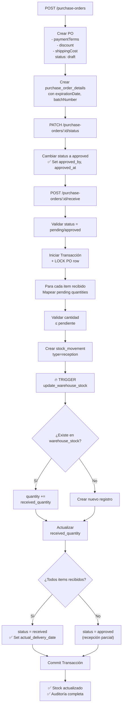

# Flujo de Purchase Orders y Gestión de Stock

## Resumen Ejecutivo

El sistema maneja el stock de manera **automática** mediante un **trigger de base de datos** (`trg_update_warehouse_stock`) que se activa cuando se crea un registro en `stock_movements`. No necesitas actualizar manualmente `warehouse_stock`.

---

## 1. Crear Purchase Order (POST `/api/v1/inventory/purchase-orders`)

### Flujo del Código

```typescript
// purchase-order.service.ts - createPurchaseOrder()
```

**Pasos:**

1. **Validación de datos** (via `createPurchaseOrderValidator`)
   - `supplierId` (requerido)
   - `warehouseId` (requerido)
   - `expectedDate` (opcional)
   - `items[]` con `productId`, `quantity`, `unitCost`

2. **Creación en base de datos** (via `PurchaseOrderRepository.create()`)
   ```typescript
   // Se crea el registro en purchase_orders
   {
     supplier_id, warehouse_id, expected_delivery_date,
     po_number: "PO-241202-XXXX", // auto-generado
     subtotal: calculado,
     discount: opcional,           // ← NUEVO
     shipping_cost: opcional,      // ← NUEVO
     total: calculado (subtotal - discount + shipping_cost),
     payment_terms: requerido,     // ← NUEVO: "immediate" | "one_payment" | "two_payments" | "three_payments"
     status: 'draft'
   }
   
   // Se crean los detalles en purchase_order_details
   {
     purchase_order_id, product_id, quantity, unit_cost,
     subtotal: quantity * unit_cost,
     tax: 0,
     total: quantity * unit_cost,
     received_quantity: 0,          // importante!
     expiration_date: opcional,
     batch_number: opcional,
     notes: opcional
   }
   ```

3. **Resultado:** Purchase Order creada con `status: 'draft'`

> **⚠️ IMPORTANTE:** En este punto **NO se afecta el stock**. Solo se registra la orden.

---

## 2. Actualizar Estado de Purchase Order (PATCH `/api/v1/inventory/purchase-orders/:id/status`) ✨ **NUEVO**

### Flujo del Código

```typescript
// purchase-order.service.ts - updatePurchaseOrderStatus()
```

**Pasos:**

1. **Validación de datos** (via `updateStatusValidator`)
   - `status` (requerido): `draft`, `pending`, `approved`, `received`, `cancelled`

2. **Validaciones de Transición de Estado** (via `PurchaseOrderService.updatePurchaseOrderStatus()`)
   
   Transiciones permitidas:
   ```typescript
   const STATUS_TRANSITIONS = {
       draft: ['pending', 'cancelled'],
       pending: ['approved', 'cancelled', 'draft'],
       approved: ['cancelled'],
       received: [],           // ← NO puede transicionar (solo via receivePurchaseOrder)
       cancelled: []           // ← NO puede transicionar
   };
   ```

   **⚠️ Restricción Crítica:** No puedes cancelar una orden que tenga items recibidos:
   ```typescript
   if (status === 'cancelled' && hasReceivedItems) {
       throw new Error('Cannot cancel order with received items. Create a return instead.');
   }
   ```

3. **Actualización en base de datos** (via `PurchaseOrderRepository.updateStatus()`)
   ```typescript
   // Cuando status = 'approved':
   {
       status: 'approved',
       approved_by: userId,        // ← NUEVO
       approved_at: new Date()     // ← NUEVO
   }
   
   // Cuando status = 'received':
   {
       status: 'received',
       actual_delivery_date: "YYYY-MM-DD"  // ← NUEVO (ISO date)
   }
   ```

4. **Resultado:** Purchase Order con status actualizado y auditoría completa.

> **💡 TIP:** El status `received` SOLO se establece a través del endpoint `/receive`, no directamente.

**Ejemplo de Request:**
```bash
PATCH /api/v1/inventory/purchase-orders/{id}/status
{
  "status": "approved"
}
```

---

## 3. Recibir Mercancía (POST `/api/v1/inventory/purchase-orders/:id/receive`)

### Flujo del Código

```typescript
// purchase-order.service.ts - receivePurchaseOrder()
```

**Pasos:**

### 3.1 Validaciones Iniciales (dentro de Transacción)

```typescript
// Verifica que la orden exista y BLOQUEA la fila para evitar condiciones de carrera
const order = await PurchaseOrderRepository.findById(id, { 
    transaction, 
    lock: true  // ← IMPORTANTE: SELECT ... FOR UPDATE
});

// Verifica que el estado permita recepción
if (!['pending', 'approved'].includes(order.status)) {
    throw new Error('Cannot receive order with status: ' + order.status);
}
```

> **🔒 Nota sobre LOCK:** Si dos recepciones ocurren simultáneamente, Postgres rechazará una con un error de bloqueo, protegiendo la integridad.

### 3.2 Procesamiento de Items Recibidos (dentro de transacción)

**Paso 1: Mapear pending quantities por detail**

```typescript
const pendingByDetailId = new Map<string, number>();
for (const detail of order.purchase_order_details) {
    pendingByDetailId.set(detail.id, detail.quantity - (detail.received_quantity || 0));
}
```

Esto permite manejar **recepciones parciales** y **múltiples líneas del mismo producto** sin confusiones.

**Paso 2: Para cada item en `data.receivedItems`:**

#### A. Validar disponibilidad

```typescript
// Encuentra la línea de detalle que coincida:
// - Mismo product_id
// - Con cantidad PENDIENTE > 0
const orderDetail = details.find(
    (d: any) => d.product_id === item.productId && 
                (pendingByDetailId.get(d.id) || 0) > 0
);

if (!orderDetail) {
    throw new Error(`Product ${item.productId} not found or already fully received`);
}

// Valida que no recibas más de lo pendiente
const pending = pendingByDetailId.get(orderDetail.id) || 0;
if (item.quantity > pending) {
    throw new Error(`Cannot receive ${item.quantity}. Only ${pending} pending.`);
}
```

#### B. Crear Stock Movement

```typescript
const stockMovementData = {
    movement_type: 'reception',  // ← CLAVE!
    warehouse_id: order.warehouse_id,
    product_id: item.productId,
    quantity: item.quantity,
    unit_cost: parseFloat(orderDetail.unit_cost.toString()),
    reference_type: 'purchase_order',
    reference_id: order.id,
    movement_number: "",            // auto-generado por StockMovementRepository
    batch_number: item.batchNumber, // opcional
    expiration_date: item.expirationDate, // opcional
    notes: data.notes               // opcional
};

await StockMovementRepository.create(stockMovementData, transaction);
```

> **🔥 AQUÍ ES DONDE OCURRE LA MAGIA DEL STOCK!** El trigger `trg_update_warehouse_stock` actualiza automáticamente `warehouse_stock`.

#### C. Actualizar Cantidad Recibida

```typescript
const newReceivedQty = (orderDetail.received_quantity || 0) + item.quantity;
await PurchaseOrderRepository.updateReceivedQuantity(orderDetail.id, newReceivedQty, transaction);

// Mantener el contador en memoria sincronizado para el resto del loop
pendingByDetailId.set(orderDetail.id, pending - item.quantity);
orderDetail.received_quantity = newReceivedQty;
```

### 3.3 Actualizar Estado de la Orden

```typescript
// Verifica si todos los items fueron recibidos completamente
// usando el mapa de pending actualizado en el loop anterior
const allItemsReceived = details.every((d: any) => (pendingByDetailId.get(d.id) || 0) <= 0);

// Si todos los items se recibieron → 'received'
// Si es recepción parcial → permanece en 'approved'
const newStatus = allItemsReceived ? 'received' : 'approved';
await PurchaseOrderRepository.updateStatus(id, newStatus, userId, transaction);

// Esto establecerá:
// - Si newStatus = 'received': actual_delivery_date = hoy
// - approved_by y approved_at ya fueron establecidos en paso anterior
```

### 3.4 Commit de Transacción

Si todo sale bien, se hace commit. Si hay error, rollback automático.

---

## 4. Actualización Automática de Stock (Trigger de Base de Datos)

### Trigger: `trg_update_warehouse_stock`

**Ubicación:** [schema.sql:L971-973](file:///e:/Proyectos%20personales/CMDV2/backend/docs/database/schema.sql#L971-L973)

```sql
CREATE TRIGGER trg_update_warehouse_stock
AFTER INSERT ON inventory.stock_movements
FOR EACH ROW EXECUTE FUNCTION inventory.update_warehouse_stock();
```

### Función: `inventory.update_warehouse_stock()`

**Ubicación:** [schema.sql:L945-969](file:///e:/Proyectos%20personales/CMDV2/backend/docs/database/schema.sql#L945-L969)

```sql
CREATE OR REPLACE FUNCTION inventory.update_warehouse_stock()
RETURNS TRIGGER AS $
BEGIN
    IF (TG_OP = 'INSERT') THEN
        -- Update or insert stock
        INSERT INTO inventory.warehouse_stock (warehouse_id, product_id, quantity)
        VALUES (NEW.warehouse_id, NEW.product_id, 
                CASE 
                    WHEN NEW.movement_type IN ('purchase', 'reception', 'adjustment') 
                        THEN NEW.quantity  -- ← SUMA al stock
                    WHEN NEW.movement_type IN ('sale', 'dispatch') 
                        THEN -NEW.quantity -- ← RESTA del stock
                    ELSE 0
                END)
        ON CONFLICT (warehouse_id, product_id) 
        DO UPDATE SET 
            quantity = inventory.warehouse_stock.quantity + 
                CASE 
                    WHEN NEW.movement_type IN ('purchase', 'reception', 'adjustment') 
                        THEN NEW.quantity
                    WHEN NEW.movement_type IN ('sale', 'dispatch') 
                        THEN -NEW.quantity
                    ELSE 0
                END,
            last_updated = CURRENT_TIMESTAMP;
    END IF;
    RETURN NEW;
END;
$ LANGUAGE plpgsql;
```

### ¿Cómo Funciona?

1. **Cuando se inserta un registro en `stock_movements`** con `movement_type = 'reception'`
2. **El trigger se dispara automáticamente**
3. **Busca si existe un registro en `warehouse_stock`** para ese `(warehouse_id, product_id)`
4. **Si existe:** Suma la cantidad al stock existente
5. **Si NO existe:** Crea un nuevo registro con la cantidad inicial
6. **Actualiza `last_updated`** con timestamp actual

---

## 5. Tabla warehouse_stock

### Estructura

```typescript
{
  id: UUID,
  warehouse_id: UUID,
  product_id: UUID,
  quantity: INT,                    // Stock total
  reserved_quantity: INT,           // Stock reservado (para órdenes)
  available_quantity: INT,          // COMPUTED: quantity - reserved_quantity
  last_updated: TIMESTAMP
}
```

> **📌 NOTA:** `available_quantity` es una **columna calculada** (GENERATED ALWAYS AS)

### Constraint Único

```sql
UNIQUE(warehouse_id, product_id)
```

Esto garantiza que solo haya **un registro por producto por almacén**.

---

## 6. Diagrama de Flujo Completo



---

## 7. Tipos de Movimientos de Stock

| movement_type | Efecto en Stock | Uso |
|--------------|----------------|-----|
| `reception` | **+** Incrementa | Recepción de Purchase Orders |
| `purchase` | **+** Incrementa | Compras directas |
| `adjustment` | **+** Incrementa | Ajustes de inventario |
| `dispatch` | **-** Decrementa | Despacho a pacientes/casos |
| `sale` | **-** Decrementa | Ventas |

---

## 8. Ejemplo Práctico Completo

### Paso 1: Crear Purchase Order

**Request:**
```json
POST /api/v1/inventory/purchase-orders
{
  "supplierId": "supplier-uuid",
  "warehouseId": "warehouse-uuid",
  "expectedDate": "2024-12-15",
  "paymentTerms": "two_payments",
  "discount": 50.00,
  "shippingCost": 10.00,
  "notes": "Orden urgente",
  "items": [
    {
      "productId": "prod-456",
      "quantity": 100,
      "unitCost": 25.50,
      "expirationDate": "2025-06-30",
      "batchNumber": "BATCH-2024-001"
    }
  ]
}
```

**Response:**
```json
{
  "success": true,
  "data": {
    "id": "abc-123",
    "orderNumber": "PO-241202-1234",
    "status": "draft",
    "subtotal": 2550.00,
    "discount": 50.00,
    "shippingCost": 10.00,
    "totalAmount": 2510.00,
    "paymentTerms": "two_payments",
    ...
  }
}
```

### Paso 2: Aprobar Purchase Order ✨

**Request:**
```json
PATCH /api/v1/inventory/purchase-orders/abc-123/status
{
  "status": "approved"
}
```

**Response:**
```json
{
  "success": true,
  "data": {
    "id": "abc-123",
    "status": "approved",
    "approvedBy": "user-789",
    "approvedAt": "2024-12-02T15:30:00Z",
    ...
  }
}
```

> **📌 NOTA:** `approvedBy` y `approvedAt` se establecen automáticamente al cambiar a `approved`. El usuario debe estar autenticado.

### Paso 3: Recibir 100 unidades de Paracetamol

**Request:**
```json
POST /api/v1/inventory/purchase-orders/abc-123/receive
{
  "receivedItems": [
    {
      "productId": "prod-456",
      "quantity": 100,
      "batchNumber": "BATCH-2024-001",
      "expirationDate": "2025-06-30"
    }
  ],
  "notes": "Recepción completa"
}
```

**Response:**
```json
{
  "success": true,
  "data": {
    "id": "abc-123",
    "status": "received",
    "actualDeliveryDate": "2024-12-02",
    "items": [
      {
        "id": "detail-1",
        "productId": "prod-456",
        "quantity": 100,
        "receivedQuantity": 100,
        "batchNumber": "BATCH-2024-001",
        "expirationDate": "2025-06-30"
      }
    ]
  }
}
```

**Lo que sucede dentro de la transacción:**

1. Se crea `stock_movement`:
   ```sql
   INSERT INTO inventory.stock_movements (
     movement_type, warehouse_id, product_id, quantity, 
     unit_cost, reference_type, reference_id, 
     batch_number, expiration_date, ...
   ) VALUES (
     'reception', 'wh-001', 'prod-456', 100, 
     25.50, 'purchase_order', 'abc-123',
     'BATCH-2024-001', '2025-06-30', ...
   );
   ```

2. **Trigger automático `trg_update_warehouse_stock` ejecuta:**
   ```sql
   -- Si el producto YA existe en warehouse_stock:
   UPDATE inventory.warehouse_stock
   SET quantity = quantity + 100,  -- ej: 50 + 100 = 150
       last_updated = NOW()
   WHERE warehouse_id = 'wh-001' AND product_id = 'prod-456';
   
   -- Si el producto NO existe:
   INSERT INTO inventory.warehouse_stock (
     warehouse_id, product_id, quantity
   ) VALUES ('wh-001', 'prod-456', 100);
   ```

3. Se actualiza `purchase_order_details.received_quantity = 100`

4. Como todos los items fueron recibidos:
   ```typescript
   purchase_orders.status = 'received'
   purchase_orders.actual_delivery_date = '2024-12-02'
   ```

5. ✅ **Commit automático** de la transacción

> **Si hay error en cualquier paso:** Rollback automático — ni el stock se actualiza ni se registra la recepción.

---

## 9. Ventajas de Este Diseño

✅ **Trazabilidad completa:** Cada cambio de stock queda registrado en `stock_movements`  
✅ **Integridad de datos:** El trigger garantiza que el stock siempre esté sincronizado  
✅ **Transacciones atómicas:** Si falla algo, todo hace rollback  
✅ **Auditoría:** Puedes ver el historial completo de movimientos  
✅ **Flexibilidad:** Soporta recepciones parciales  

---

## 10. Consideraciones Importantes

### Operaciones

⚠️ **No actualices `warehouse_stock` manualmente** - El trigger lo hace automáticamente  
⚠️ **Siempre usa transacciones** - Para mantener consistencia  
⚠️ **Valida cantidades** - Antes de crear stock movements  
⚠️ **Maneja errores** - El rollback protege la integridad  
⚠️ **Actualiza el status a `approved` o `pending`** - Antes de recibir mercancía  

### Status y Transiciones

⚠️ **Status `received` solo via `/receive` endpoint** - No puedes escribir directamente  
⚠️ **No puedes cancelar órdenes con items recibidos** - Crea un retorno en su lugar  
⚠️ **Los campos `approved_by`, `approved_at` se establecen automáticamente** - Cuando cambias a `approved`  
⚠️ **El campo `actual_delivery_date` se establece automáticamente** - Cuando cambias a `received`  

### Nuevos Campos

⚠️ **`paymentTerms` es requerido** - Debe ser uno de: `"immediate" | "one_payment" | "two_payments" | "three_payments"`  
⚠️ **`discount` y `shippingCost` son opcionales** - Afectan el cálculo del `total`  
⚠️ **`expirationDate` y `batchNumber` son opcionales en items** - Úsalos para trazabilidad de lotes  

### Recepciones

⚠️ **Se permiten recepciones parciales** - Recibe parte hoy, parte después  
⚠️ **No puedes recibir más de lo pendiente** - El sistema valida automáticamente  
⚠️ **Múltiples líneas del mismo producto se manejan correctamente** - Por ejemplo, 2 lotes diferentes del mismo medicamento  
⚠️ **Lock automático previene condiciones de carrera** - Si dos recepciones ocurren simultáneamente, una será rechazada  

---

## 11. Campos de Auditoría

La tabla `purchase_orders` ahora incluye campos para rastrear aprobaciones y entregas:

| Campo | Tipo | Cuándo se establece | Valor |
|-------|------|------------------|-------|
| `approved_by` | UUID | Al cambiar a `approved` | ID del usuario que aprobó |
| `approved_at` | TIMESTAMP | Al cambiar a `approved` | Fecha/hora de aprobación |
| `actual_delivery_date` | DATE | Al cambiar a `received` | Fecha de entrega real (YYYY-MM-DD) |

**Ejemplo:**
```json
{
  "id": "abc-123",
  "status": "approved",
  "approvedBy": "user-789",
  "approvedAt": "2024-12-02T15:30:45Z",
  "actualDeliveryDate": null  // Se establece cuando status = 'received'
}
```

---

## 12. Vista de Stock Status

Puedes consultar el estado actual del stock usando la vista:

```sql
SELECT * FROM inventory.v_stock_status
WHERE warehouse_code = 'WH001' AND product_code = 'PARA-500';
```

Esta vista muestra:
- Stock actual (`quantity`)
- Stock reservado (`reserved_quantity`)
- Stock disponible (`available_quantity`)
- Nivel de stock (`critical`, `low`, `normal`)
- Valor total del inventario
